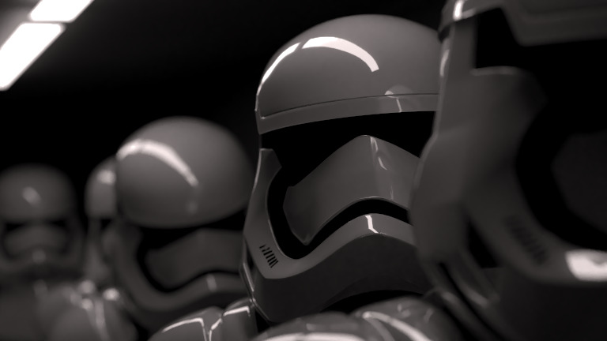
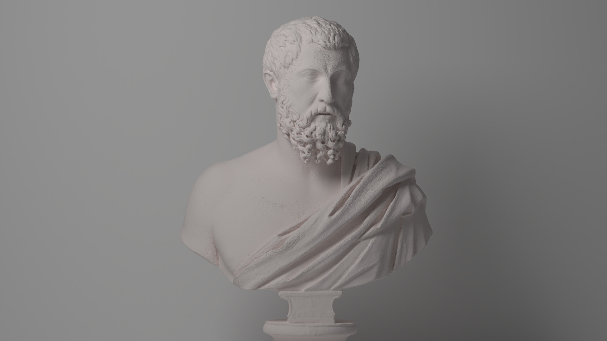
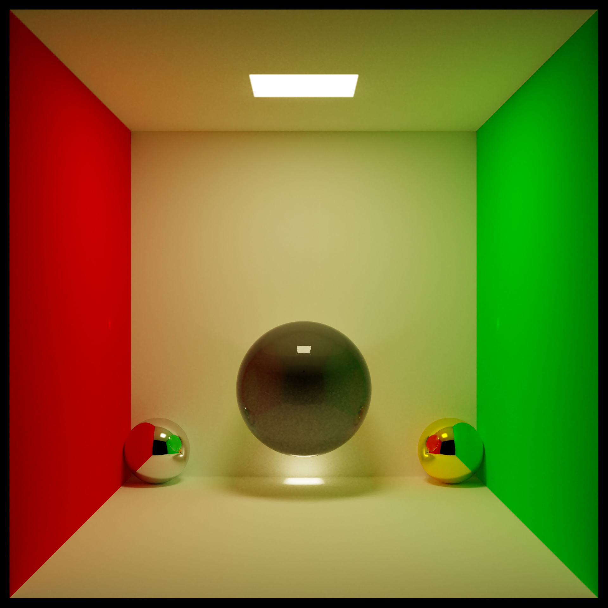

# Luz

Luz is a hand-written C++20 path tracer built from scratch with ZERO third-party libraries.




## Features

- Monte Carlo path tracing
- Global illumination
- Multithreaded CPU rendering
- Adaptive sampling
- Denoiser (NFOR-style)
- Spheres, planes, rectangles, triangles, cubes, volumes, and OBJ meshes
- Lambertian, metal, dielectric, emissive, and isotropic materials
- Area, point, sphere and directional lights
- Custom `.luz` scene files
- .blend to .luz converter
- Fully customizable render parameters via CLI or scene file
- Importance sampling with PDFs
- BVH acceleration, including packed mesh BVHs with binned SAH construction and near-first traversal
- Atmospheric simulation w/ scattering
- Depth of field, antialiasing, exposure, contrast, tone mapping, gamma correction, and bloom
- BMP and TIFF output
- Deterministic benchmark harness with render, denoise, post-process, and score breakdowns

## Quick Start

Build with the Makefile:

```sh
make
```

Render a bundled example scene:

```sh
./Luz --file examples/scenes/blender_monkey.luz --samples 50 --resolution 300x300
```

The default output is `render.bmp`. Scene files can set `outputfilename=...`, and the CLI can override common render settings.

Run the test suite:

```sh
make test
```

Run the deterministic default benchmark case:

```sh
./Luz --benchmark --seed 424242424 --threads 1
```

Run a real scene in benchmark mode:

```sh
./Luz --file exports/stormtroopers.luz --resolution 320x180 --samples 128 --denoise --adaptive --max-light-bounces 5 --benchmark
```

Run the containerized benchmark matrix and save raw results:

```sh
make benchmark BENCH_CPUS=1 BENCH_THREADS=1 > before.csv
```

The benchmark score is printed to stderr at the end of the run, so redirecting stdout still writes a clean raw CSV.

After an optimization, run it again and compare medians:

```sh
make benchmark BENCH_CPUS=1 BENCH_THREADS=1 > after.csv
make benchmark-compare BEFORE=before.csv AFTER=after.csv
```

Score benchmark results:

```sh
make benchmark-score RESULTS=after.csv
```

Each case score is the median kilo-samples per minute for that case.
Raw benchmark CSVs include elapsed time, render time, denoise time, post-process
time, total samples rendered, average samples per pixel, actual score, and a
render-only score. The compare script reports elapsed speedup, render-time
speedup, score speedup, render-score speedup, and how much non-render work is in
each case.

The overall score uses the geometric mean of per-case scores, so running the score command on `before.csv` and `after.csv`
gives comparable scores when the benchmark settings are the same.
The default benchmark matrix covers Cornell-style lighting, many objects, mesh BVH traversal, diffuse scattering,
post-processing, atmosphere, mixed light types, emissive geometry, primitives/materials, volumes, OBJ meshes,
and representative stormtrooper scene cases.

## CMake

A CMake build is also available:

```sh
cmake -S . -B build
cmake --build build
ctest --test-dir build
```

## CLI

```text
Usage: ./Luz [options]

  -f, --file PATH             Load a .luz scene file
  -r, --resolution WxH        Override render resolution
  -s, --samples N             Override samples per pixel
  --adaptive [true|false]     Enable adaptive per-pixel sampling
  --no-adaptive               Disable adaptive sampling
  --adaptive-min-samples N    Minimum samples before adaptive stopping
  --adaptive-threshold F      Relative adaptive noise threshold
  --adaptive-check-interval N Adaptive convergence check interval
  -mlb, --maxLightBounces N   Override maximum light bounces
      --max-light-bounces N   Alias for --maxLightBounces
  -t, --threads N             Render with N worker threads
  --seed N                    Seed random sampling
  --gamma true|false          Toggle gamma correction
  -tm, --tonemapping true|false  Toggle tone mapping
  --bloom true|false          Toggle bloom
  --exposure EV              Exposure compensation in stops
  --contrast F               Display contrast multiplier
  --denoise [true|false]      Write a denoised companion render
  --no-denoise                Disable denoising
  -o, --output PATH           Override render output path
  --denoise-output PATH       Override denoised output path
  --render-times              Write renderTime.bmp
  --benchmark                 Run the built-in benchmark scene
  --benchmark-case NAME       Benchmark case: default, many-objects, mesh-bvh, diffuse, postprocess, atmosphere, lights, emissive-geometry, primitives-materials, volumes, obj-mesh
```

## Adaptive Sampling

`--adaptive` treats `--samples` as the maximum samples per pixel. Each pixel
uses a progressive per-pixel sample sequence, renders at least
`--adaptive-min-samples`, then periodically checks luminance and RGB confidence
intervals. Very dark pixels use a conservative minimum before they can stop, so
rare light contributions are less likely to be mistaken for converged black.

Lower thresholds keep more detail and cost more time. For final renders, start
with a high max sample count and tune with values like:

```sh
./Luz --file exports/stormtroopers.luz --samples 4096 --adaptive --adaptive-min-samples 512 --adaptive-check-interval 64 --adaptive-threshold 0.005 --denoise
```

## Denoising

`--denoise` enables Luz's NFOR-style feature-buffer denoiser and writes a
separate companion image. By default, `render.bmp` becomes
`render_denoised.bmp`; use `--denoise-output PATH` to choose the exact path.

The denoiser has no hard minimum resolution or sample count, but it needs enough
signal to estimate useful color and feature statistics. One sample per pixel is
mainly a stress test: there is no per-pixel variance estimate, so the denoised
image can look almost unchanged or can smooth the wrong details. Use at least a
few samples per pixel for previews, and prefer roughly 16+ samples per pixel
when judging denoiser quality. Very low resolutions also make evaluation
misleading because each local filter window covers too much of the image.

## Scene Files

Example scenes live in `examples/scenes/`. Mesh assets live in `assets/objects/`. The scene-file format is documented in [`docs/scene-files.md`](docs/scene-files.md).

Object paths in `.luz` files are resolved relative to the scene file first, then relative to the current working directory, then under `assets/objects/`. This means `examples/scenes/blender_monkey.luz` can reference `../../assets/objects/blender_monkey.obj` and still run from the repository root.

OBJ meshes can also be offset and assigned a scene material:

```text
obj=mesh.obj,(x,y,z),material[
metal=(0.8,0.8,0.8),0.1
]
```

## Blender Exporter

Blender scenes can be exported through Blender's Python API:

```sh
"/Applications/Blender.app/Contents/MacOS/Blender" -b scene.blend --python tools/blender_export_luz.py -- --output exports/scene.luz
./Luz --file exports/scene.luz --threads 8
```

The exporter writes a `.luz` file plus OBJ meshes. Usage and current fidelity
limits are documented in [`docs/blender-exporter.md`](docs/blender-exporter.md).

## Repository Layout

```text
include/luz/       Public headers
src/core/          Math, geometry, materials, image, and sampling code
src/renderer/      Rendering implementation
src/scene/         Scene model and scene helpers
src/io/            Scene-file, OBJ, BMP, and TIFF loading/writing
src/cli/           Command-line entry point and flags
examples/scenes/   Example .luz scene files
assets/objects/    OBJ assets used by examples
docs/images/       Compressed showcase images
tools/             Export and utility scripts
tests/             Standard-library-only test program
docker/            Benchmark container
```

## Showcase




## Personal Note

Special thanks to the [Ray Tracing in One Weekend](https://github.com/RayTracing/raytracing.github.io) book series. It was a great source of inspiration and information during a big part of the development of Luz, specially since those were times before AI.

## Attribution

Stormtrooper Scene by @[ScottGraham](https://blendswap.com/profile/120125) on [BlendSwap](https://blendswap.com/blend/13953).

Bust Statue by @[geoffreymarchal](https://blendswap.com/profile/180520) on [BlendSwap](https://blendswap.com/blend/21704).

## License

MIT. See `LICENSE`.
