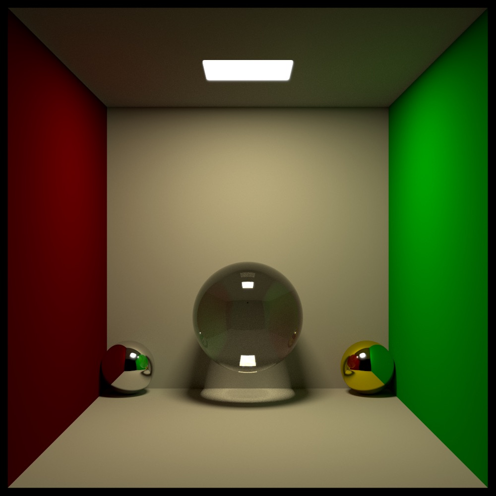
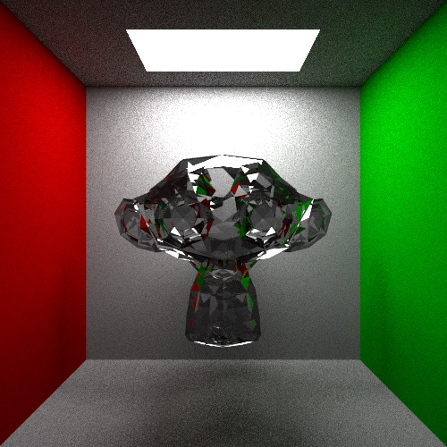
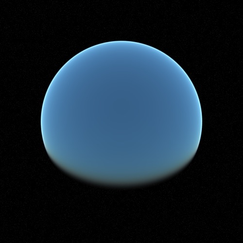

# Luz

Luz is a hand-written C++20 path tracer built with only the C++ standard library.



## Features

- Monte Carlo path tracing
- Multithreaded rendering
- Spheres, planes, rectangles, triangles, cubes, volumes, and OBJ meshes
- Lambertian, metal, dielectric, emissive, and isotropic materials
- Custom `.luz` scene files
- OBJ mesh loading
- Importance sampling with PDFs
- BVH acceleration
- Atmospheric scattering
- Depth of field, antialiasing, tone mapping, gamma correction, and bloom
- BMP and TIFF output

## Quick Start

Build with the Makefile:

```sh
make
```

Render the bundled demo scene:

```sh
./Luz --file examples/scenes/demo.luz --samples 8 --resolution 300x300 --threads 4
```

The default output is `render.bmp`. Scene files can set `outputfilename=...`, and the CLI can override common render settings.

Run the test suite:

```sh
make test
```

Run the deterministic default benchmark scene:

```sh
./Luz --benchmark --seed 424242424 --threads 1
```

Run the containerized benchmark matrix and save raw results:

```sh
make benchmark BENCH_CPUS=1 BENCH_THREADS=1 > before.csv
```

The benchmark score is printed to stderr at the end of the run, so redirecting stdout still writes a clean raw CSV.

After an optimization, run it again and compare medians:

```sh
make benchmark BENCH_CPUS=1 BENCH_THREADS=1 > after.csv
make benchmark-compare BEFORE=before.csv AFTER=after.csv
```

Score benchmark results:

```sh
make benchmark-score RESULTS=after.csv
```

Each case score is the median kilo-samples per minute for that case.
The overall score uses the geometric mean of per-case scores, so running the score command on `before.csv` and `after.csv`
gives comparable scores when the benchmark settings are the same.
The default benchmark matrix covers Cornell-style lighting, many objects, mesh BVH traversal, diffuse scattering,
post-processing, atmosphere, mixed light types, emissive geometry, primitives/materials, volumes, and OBJ meshes.

## CMake

A CMake build is also available:

```sh
cmake -S . -B build
cmake --build build
ctest --test-dir build
```

## CLI

```text
Usage: ./Luz [options]

  -f, --file PATH             Load a .luz scene file
  -r, --resolution WxH        Override render resolution
  -s, --samples N             Override samples per pixel
  -mlb, --maxLightBounces N   Override maximum light bounces
  -t, --threads N             Render with N worker threads
  --seed N                    Seed random sampling
  --gamma true|false          Toggle gamma correction
  -tm, --tonemapping true|false  Toggle tone mapping
  --bloom true|false          Toggle bloom
  --denoise [true|false]      Write a denoised companion render
  --no-denoise                Disable denoising
  --denoise-output PATH       Override denoised output path
  --render-times              Write renderTime.bmp
  --benchmark                 Run the built-in benchmark scene
  --benchmark-case NAME       Benchmark case: default, many-objects, mesh-bvh, diffuse, postprocess, atmosphere, lights, emissive-geometry, primitives-materials, volumes, obj-mesh
```

## Scene Files

Example scenes live in `examples/scenes/`. Mesh assets live in `assets/objects/`. The scene-file format is documented in [`docs/scene-files.md`](docs/scene-files.md).

Object paths in `.luz` files are resolved relative to the scene file first, then relative to the current working directory, then under `assets/objects/`. This means `examples/scenes/demo.luz` can reference `../../assets/objects/pyramid.obj` and still run from the repository root.

OBJ meshes can also be offset and assigned a scene material:

```text
obj=mesh.obj,(x,y,z),material[
metal=(0.8,0.8,0.8),0.1
]
```

## Blender Exporter

Blender scenes can be exported through Blender's Python API:

```sh
"/Applications/Blender.app/Contents/MacOS/Blender" -b scene.blend --python tools/blender_export_luz.py -- --output exports/scene.luz
./Luz --file exports/scene.luz --threads 8
```

The exporter writes a `.luz` file plus OBJ meshes. Usage and current fidelity
limits are documented in [`docs/blender-exporter.md`](docs/blender-exporter.md).

## Repository Layout

```text
include/luz/       Public headers
src/core/          Math, geometry, materials, image, and sampling code
src/renderer/      Rendering implementation
src/scene/         Scene model and scene helpers
src/io/            Scene-file, OBJ, BMP, and TIFF loading/writing
src/cli/           Command-line entry point and flags
examples/scenes/   Example .luz scene files
assets/objects/    OBJ assets used by examples
docs/images/       Compressed showcase images
tools/             Export and utility scripts
tests/             Standard-library-only test program
docker/            Benchmark container
```

## Showcase





## License

MIT. See `LICENSE`.
